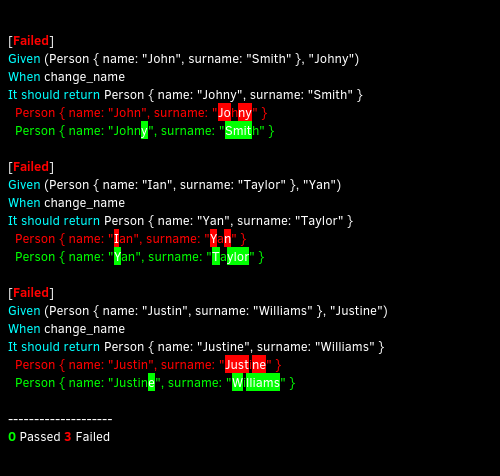
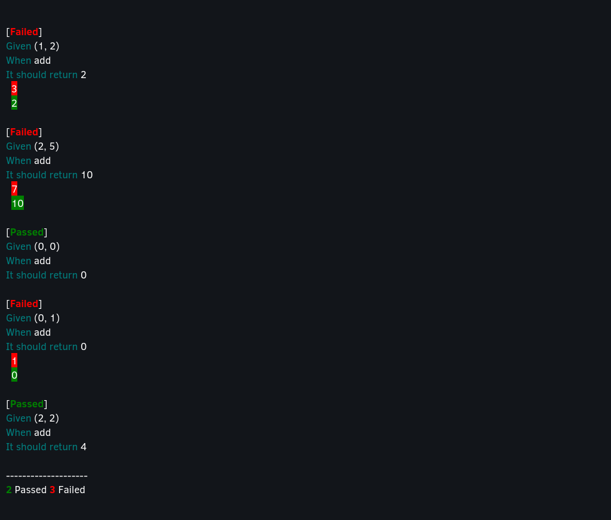

# Table Test
[](https://travis-ci.org/nathanielsimard/table-test)

This library aims to make table testing reliable in `Rust`. 
The problem is `assert_eq!` calling `panic!` when it fails making all the other cases untested.

## Usage

Specify this crate as `[dev-dependencies]` because it should only be used for testing.

```toml
[dev-dependencies]
table_test = "*"
```

```rust
#[cfg(test)] // <-- not needed in integration tests
#[macro_use]
extern crate table_test;
```

The table iterator returns a tuple `(validator, input, expected)`.
If you have more than one input, just use a tuple of inputs.

```rust
#[test]
fn test_add() {
    let table = table_test!(
        add,
        vec![
            ((1, 2), 3),
            ((2, 5), 7),
            ((0, 0), 0),
            ((0, 1), 1),
            ((2, 2), 4),
        ]
    );

    for (validator, (input_1, input_2), expected) in table {
        let actual = add(input_1, input_2);

        validator.assert_eq(actual, expected);
    }
}
```

## Examples

Output for example [change name](examples/change_name.rs):



Output for example [add](examples/add.rs):

